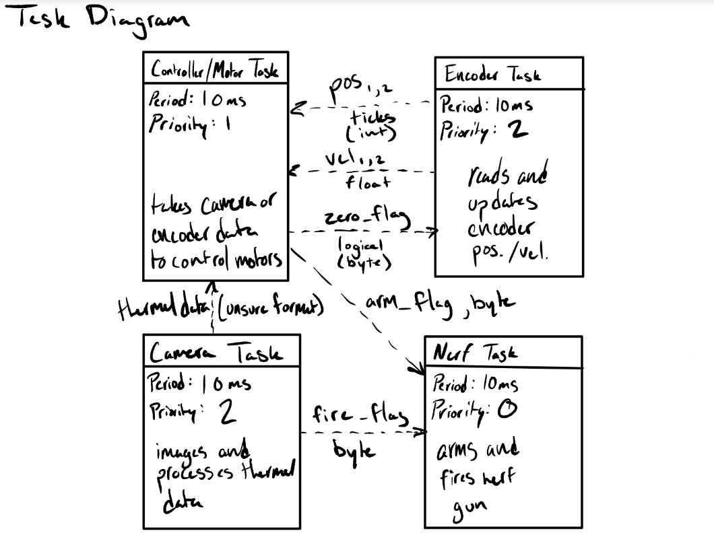

# ME 405 Term Project: Nerf Sentry Turret

Group: Mecha15
Sean Wahl, Nathan Dodd, Lewis Kanagy

## Overview

We are building a dueling, heat-tracking nerf sentry turret. Keep updated.

## Task Diagram

## State Transition Diagrams

