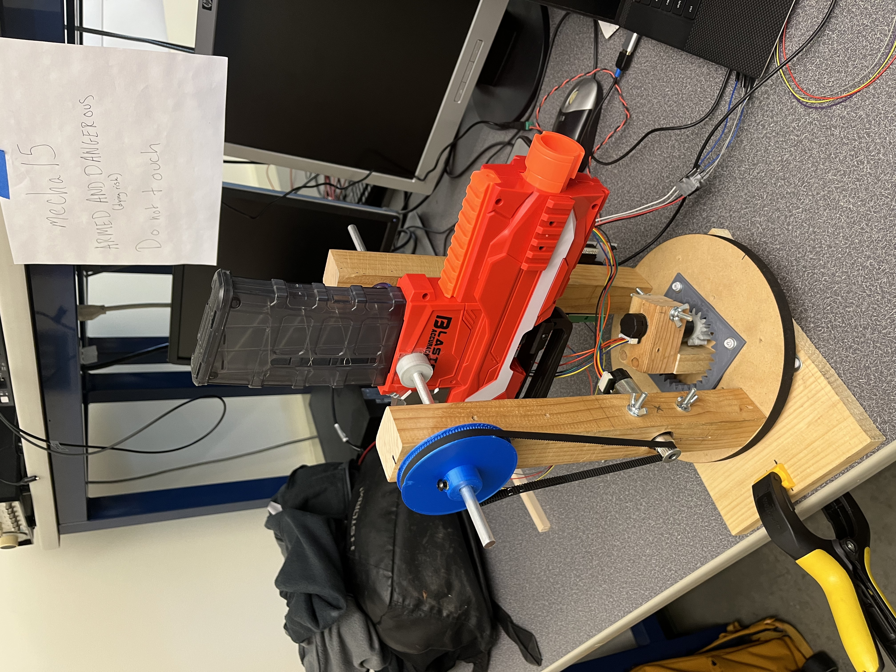
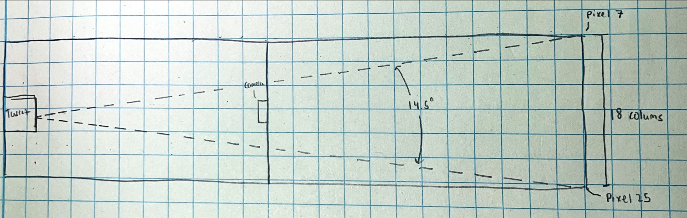
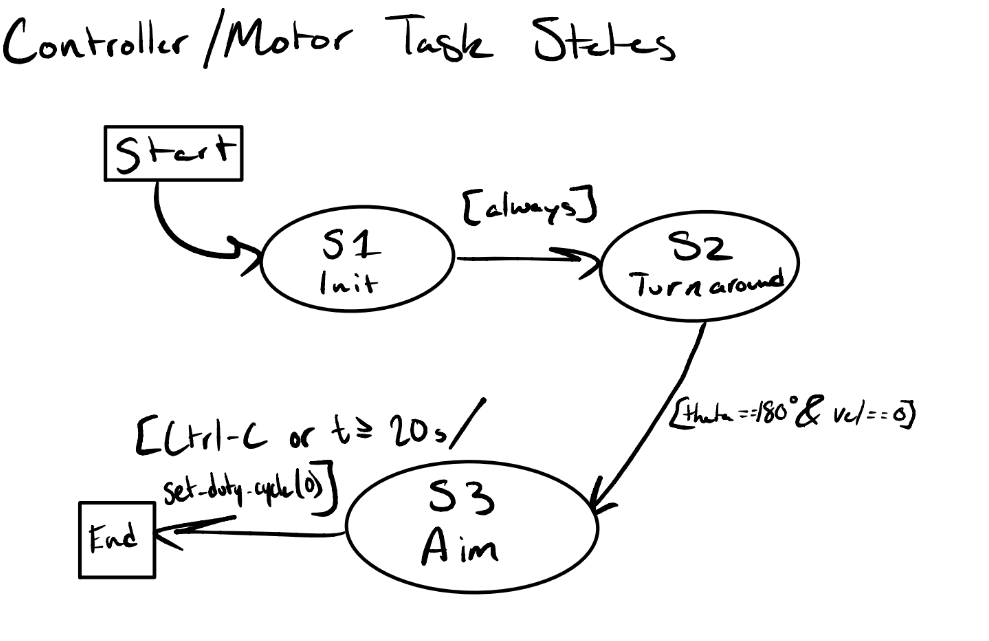
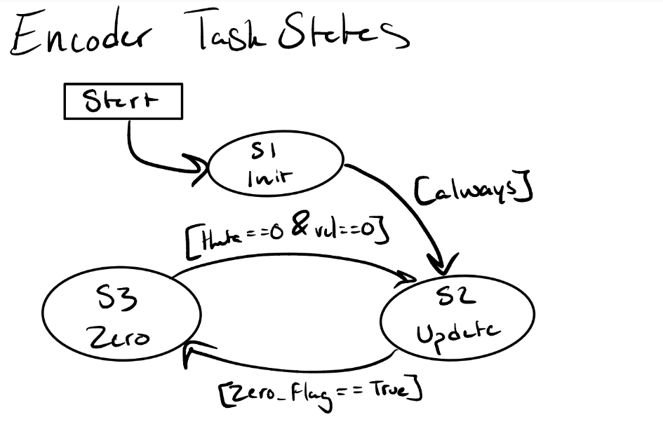
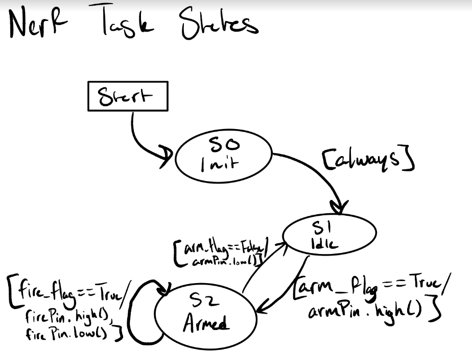
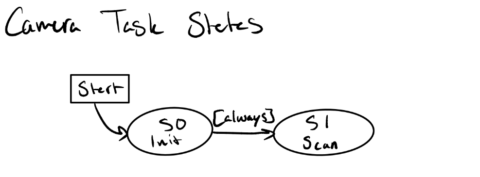

# ME 405 Term Project: Nerf Sentry Turret

Group: Mecha15
Sean Wahl, Nathan Dodd, Lewis Kanagy

## Overview

The goal of the Nerf Sentry Turret project is to learn by doing some of the most importnat topics in ME 405. These topics include 
designing systems of modest complexity with both mechanical and electrical components, using control systems to operate mechanical systems, and 
organizing software into discrete modules to call between python files. 

The project entails the consturction and calibration of a thermal sensing target acquisition system that can launch a projectile beyond 
16 feet. The team must use a given thermal camera, STM32 MCU Unit, and a selected Nerf launcher to "duel" an opposing team. The two teams are 
placed 16 feet apart, and upon a "Start" signal, the opposing systems must rotate 180 degrees using mechanical components, gather thermal data through I2C communication,
and use electical components to fire the launcher.

Figure 5.1. Final Nerf Sentry Turret Design

## Mechanical Design

The group began by mechanically designing the spinning base of the system, as seen in Figure 5.2. The system consists of a 3-D printed Internal gear, rotated by another
3_d printed gear head press fit onto the given ME 405 motor shaft. The circular wooden base rotates upon the rectangular base via a purchased, commercially available 
"lazy susan." The motor is mounted using a similar system to the ME 405 motor mounts, with a through hole in a wooden block tightened to hold the motor from the compressive
force applied thorugh the screw/wingnut components. Therefore, as the motor is spun, it rotates the entire circular wooden base which all components rest upon. 

FIgure 5.2. Base Assembly

The top assembly was constructed the following week, composing of two standing obelisks, two bearings, the mounted shaft, and finally, the nerf gun. The obelisks are screwed
into the circular base, and with one of the obelisks using a similar clamping mechanism as the "yaw" motor to mount the "pitch" motor. The rotating mechanism is controlled by 
the gear-pulley system seen in Figure 5.1. Additionally, through holes are drilled  in the top of each obelisk to allow the alumnium shaft to pass thorugh, with bearings inlayed 
in the wood to house the metal shaft. Finally, the nerf gun is mounted to the shaft via 3-D printed brackets press fit onto the shaft; these brackets have a flat portion, as does the 
shaft, allowing the rotating shaft to rotate the gun as needed.

## Electrical Design

Mounted to the bottom assembly is the given ME 405 STM32 MCU unit, including the proper motor driver board (Figure 5.3). The MCU has wiring to the base motor (yaw) and obelisk 
motor (pitch) to give the system its two degrees of freedom; the intitialization, operation, and control of these motors can be found in the attached source code. The 
nerf gun itself is operated through a "hotwiring" approach, with the its two systems, flywheel and dart push mechanisms, wired to an attached bread board. The board 
contains relays, resistors, and mosfets to apply a set amount of voltage to the gun from the Nucleo GPIO pins. 

Figure 5.3. Electrical Assembly

## Software Design 

The software used for the project can all be found in the source code folder (src) found in the github page. A general overview of the software design can be better understood by 
looking at the attached State Transition Diagrams found at the bottom of the README file. 

Touching upon the thermal camera tracking algorithim, the camera was placed 8 feet in front of the turret system in order to give the highest image resolution to be analyzed. Within the 
mlx_camera.py file, the data received through the lens was a 24 row x 32 column csv grid of values 0-99, representing the magnitude of heat signature received. The code added to
the given mlx_camera.py analyzed each column upon taking a photo, averaged values in each column, and returned the column index. Given that opponents could only stand up against the table
and not off the sides, the table width was mapped out to the number of columns the camera can place. Assuming that the camera and turret would be placed in the same location every test, 
a unit conversion between (table width/columns) and (yaw position/table width) allowed a set position to be sent to the motor for a given "hottest column." A rough sketch of this can be
found below in Figure 5.4.

Figure 5.4. Sketch of table geometry to derive yaw motor setpoint given a "hot column" value.

## Project Results

The system that was designed, manufactured, and tested performed exceedingly well in testing prior to the performance on the dueling day. In nearly every test ran in which the motors
were set to a given setpoint, the thermal camera was allowed 1 second to record a picture, and the opponent did not move within the 1 second, the sentry could accurately move the yaw
motor and "track" a given heat signature and fire at will. When facing opponents in the testing phase, the turret would hit the opponent first before the opponent would fire, 
allowing the team to gain confidence heading into the dueling day. Come match day, all mechanical and electrical components worked, however in the final critical round, the 
magazine was forgotten to be refilled, leading to a defeat. Although this was difficult to grasp, the team was confident that should the magazine have been loaded, it surely would have
resulted in a hit target and a victory.

After undertaking this project for 3 weeks, the team has learned an outstanding amount about the mechatronics design process; even more so, the group has learned what worked well
and what has not for our specific system. Regarding software design, we originally attempted to configure the cotask.py, task_share.py, and basic_tasks.py files to allow for 
priority based scheduling of tasks. We quickly encountered problems, as this priorty task organization encountered issues when tasks, such as the camera task needing over 1 second
to capture an image, would go over its set period time. Instead, the software design of the main file entailed a much simpler finite state machine, swithcing between two simple states.
Going away from this task-sharing system sooner rather than later would have allowed for more time for the group to finalize designs such as camera placement, 

What worked well mechanically was the relatively small gear ratio for the "yaw" axis. The base plate was able to turn around quickly compared to other groups in the section, primarily
due to the gear ratio of 2.5. When facing groups with many more teeth on their internal gears, they were mechanically limited in the speed at which they could rotate. 
3-D printing the gears allowed for larger design control over this element; larger gear teeth worked well, as they were easier to mesh than the much smaller, 16 teeth gears supplied
in class.

Should further testing and design take place on this specific assembly, a useful addition would be a concrete electrical wiring setup. Given the team was still conducting basic testing
upon the dueling date, a clear, robust wiring setup could not be formed. Further research could also be done to use a different MCU running C/C++ code, as this seemed succesful for 
other groups in allowing for up to 60 captures / second; the software/hardware used permitted for roughly 1 capture/second. Further research could prove a useful project for one
interested in any robotics, mechanical design, or thermal camera applications. 

## State Transition Diagrams

# Need to add main FSM

